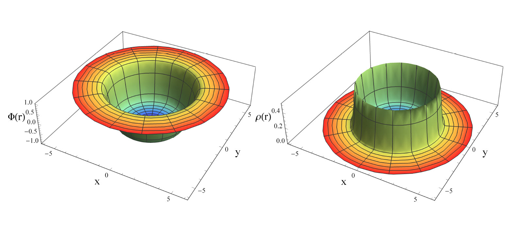

# Evading Derrick's theorem in curved space: Static metastable spherical domain wall

### :clipboard: Information
------------------

This repository contains the Mathematica files necessary for the reproduction of the figures as well as the numerical analysis of [10.1103/PhysRevD.99.064026](https://journals.aps.org/prd/abstract/10.1103/PhysRevD.99.064026), also found as [arXiv:1901.06659](https://arxiv.org/pdf/1901.06659.pdf).

If you use this Mathematica code or any of the figures please make sure to cite [10.1103/PhysRevD.99.064026](https://journals.aps.org/prd/abstract/10.1103/PhysRevD.99.064026).

Any comments or suggestions are welcome! :smiley:
